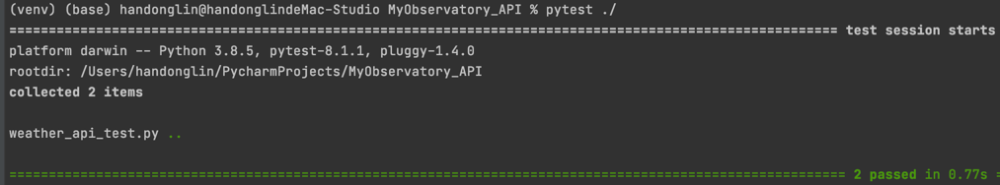
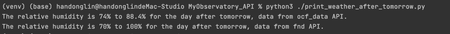
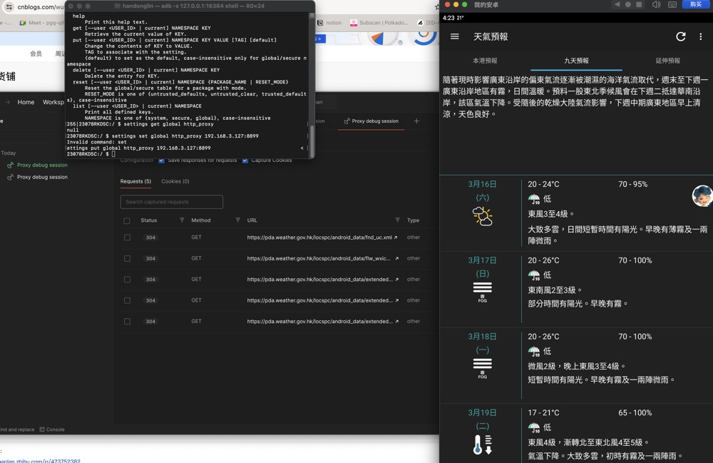

## Install requirements
- CMD : `pip3 install -r requirements.txt`

## Test API
- Test the request response status is whether successful or not
  - CMD : `pytest ./tests/weather_api_test.py`
    - 

## Get The  relative humidity  for the day after tomorrow from the API response
- CMD : `python3 ./print_weather_after_tomorrow.py`
  - 
  
## Capture the APP API : 
- Get Local PC IP : 192.168.3.127
- Use Postman to "start proxy" on port: 8899  
- Set android network proxy on adb shell:
  - `settings set global http_proxy 192.168.3.127:8899`
- check the api response to identify the api:
  - 
  - `WEATHER_FND_URL = "https://pda.weather.gov.hk/locspc/android_data/fnd_uc.xml"`
  - `WEATHER_URL = "https://pda.weather.gov.hk/locspc/android_data/ocf_data/HKO.v2.xml"`
  

